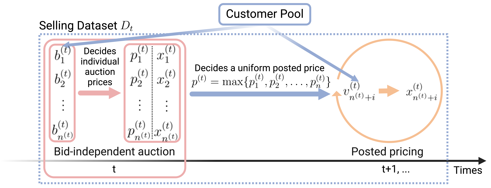
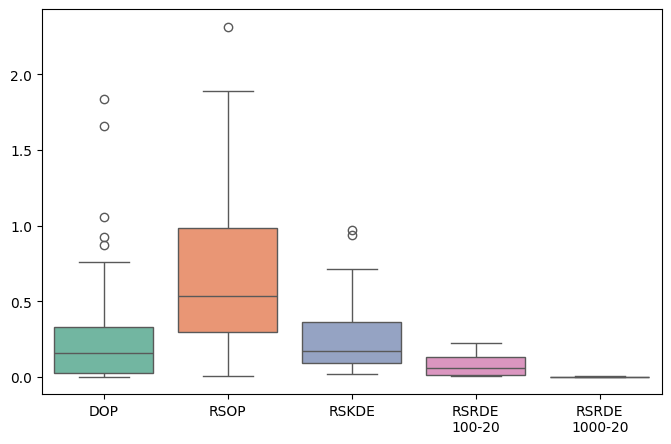
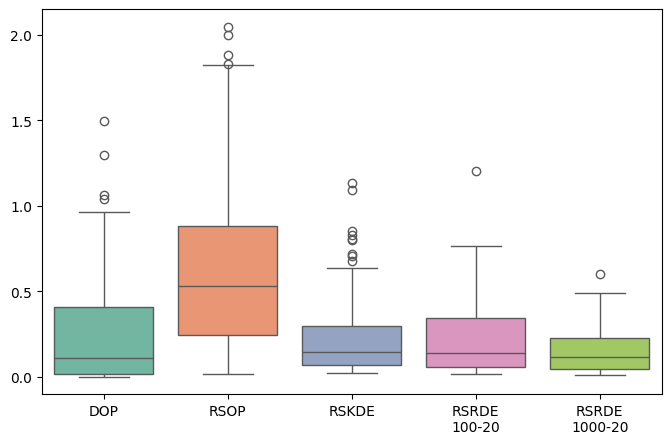
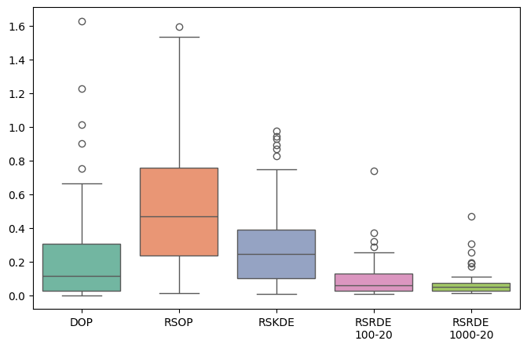
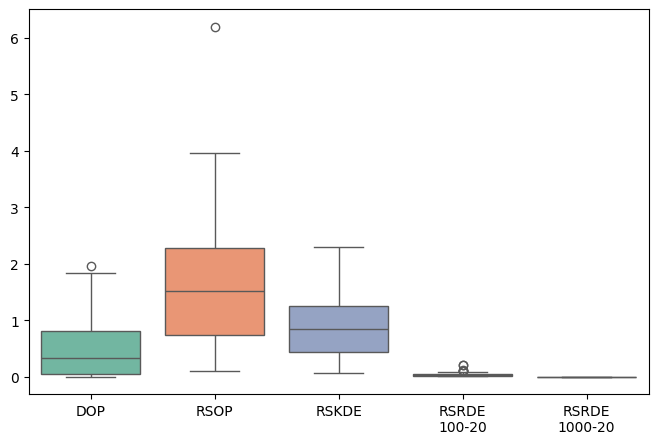

# Market Design of Machine Learning Data Marketplace

This repository is the official implementation of [Market Design of Machine Learning Data Marketplace](https://openreview.net/forum?id=TA4uUUuRlq). 



## Requirements

To install requirements:

```setup
pip install -r requirements.txt
```

We also require [R](https://cran.r-project.org) along with [spatstats](https://spatstat.org/) and [densityFPCA](https://github.com/jiamingqiu/densityFPCA) packages in R. 

## Real data

To preprocess the real FCC AWS-3 Auction Data, download it as a .csv file from this [website](https://www.fcc.gov/auction/97) and run:

```preprocess
python preprocess.py
```

## Simulate test information

To generate a fixed test distribution, the corresponding ideal expected per capita revenue, and 100 random samples of 10 test bids each, run this command:

```test
python test.py [-h] --dist-type {uniform,normal,exponential,real} [--output-uri OUTPUT_URI] --r-home R_HOME
```
Example - simulation of test bids from a uniform distribution family 
```example
python test.py --dist-type real --output-uri /tmp/sim-tests/ --r-home /Library/Frameworks/R.framework/Versions/4.4-arm64/Resources/library  
```

## Training of RSRDE(s)

To train the RSRDE(s) in the paper, run this command:

```train
python train.py [-h] --dist-type {uniform,normal,exponential,real} --num-training-bids NUM_TRAINING_BIDS --num-training-rounds NUM_TRAINING_ROUNDS [--output-uri OUTPUT_URI]
```

## Evaluation

To calculate the average regrets over 200 random partitions of bids while utilizing the following 4 mechanisms - DOP, RSOP, RSKDE, and RSRDE, run:

```eval
python eval.py [-h] --dist-type {uniform,normal,exponential,real} --mechanism {DOP,RSOP,RSKDE,RSRDE} [--num-training-bids NUM_TRAINING_BIDS] [--num-training-rounds NUM_TRAINING_ROUNDS] [--output-uri OUTPUT_URI] --r-home R_HOME
```

To plot the regrets and compare visually, run:

```plot-code
plot.py [-h] --dist-type {uniform,normal,exponential,real} [--output-uri OUTPUT_URI] [--zoom {Yes,No}]
```

## Results

Our model achieves the following performance on :
Uniform                    |Normal
:-------------------------:|:-------------------------:
 | 

Exponential                |Real
:-------------------------:|:-------------------------:
 | 


